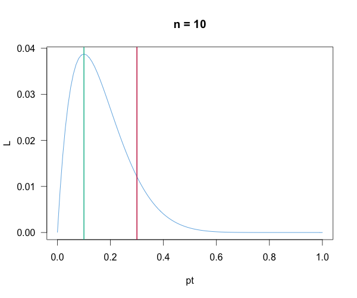
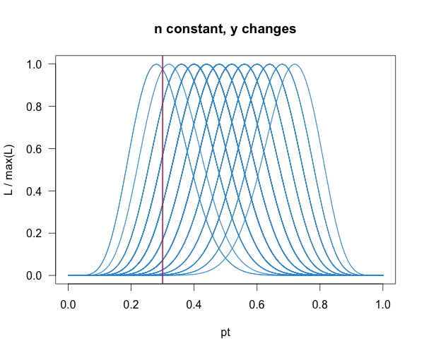
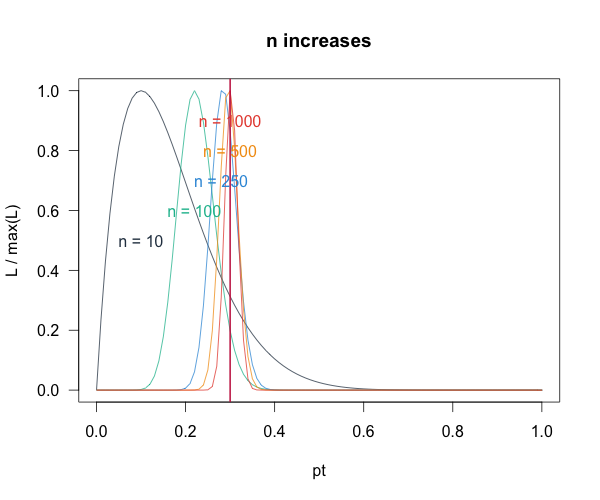
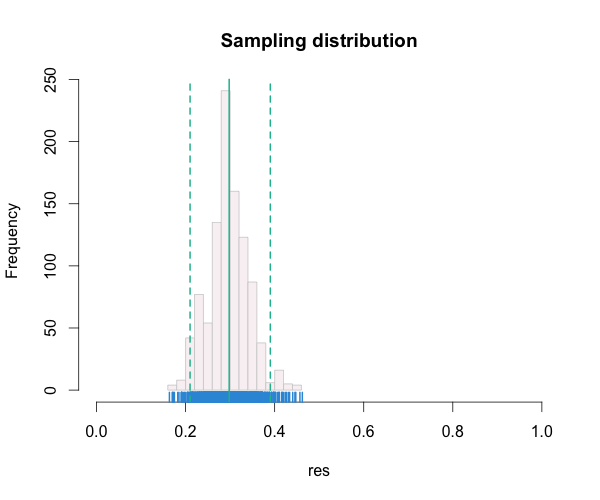
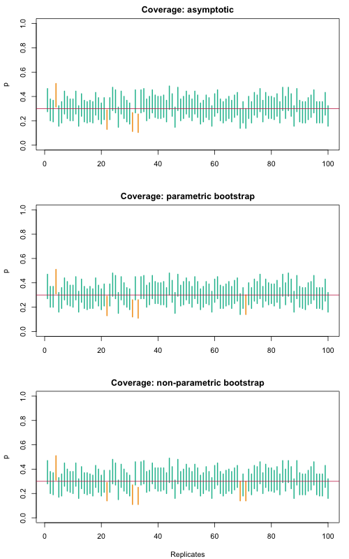
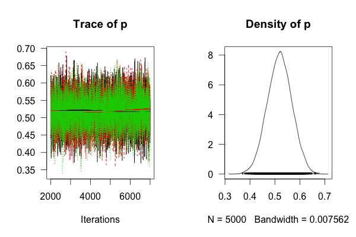
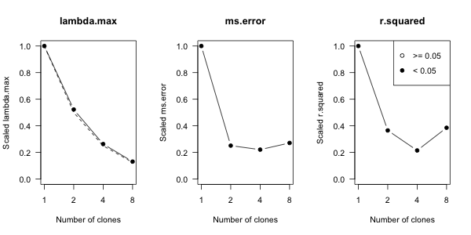

## Introduction

Science, as we envision it, is an interplay between inductive and deductive processes. Francis Bacon, the father of what is known as the scientific method, emphasizes the roles of observations, alternative explanations and tests to choose among various explanations. Bacon saw science as inductive process, moving from the particular to the general (Susser, 1986). 

Popper (1959) proposed the doctrine of falsification, which defines what is acceptable as a scientific hypothesis: if a statement cannot be falsified, then it is *not* a scientific hypothesis. This is intrinsically a deductive process. What is common to these different views is that theories need to be probed to assess their correctness. Observations play an important role in such probing. 

In most scientific situations, we are interested in understanding the natural processes that have given rise to the observations. Such understanding generally leads to prediction and possibly control of the processes. Traditionally, we formulate our understanding of the processes in terms of mathematical models. These mathematical models may be deterministic or may be stochastic.

It is widely accepted, at least by the statisticians, that stochastic models represent nature more effectively than pure deterministic models. Aside from the natural stochasticity in the system, the observations themselves might have measurement error making it necessary to consider stochastic models to model observations. 

One of the consequences of stochastic models is that Popper's theory of falsification does not strictly apply. No data are strictly inconsistent with a stochastic model, except in artificial situations or trivially improper models. Thus, one can only say that the observed data are more likely under one model than the other; or that the strength of evidence for one hypothesis is larger than for an alternative. We cannot outright accept or reject a hypothesis. 

Given a set of stochastic models (or, equivalently a set of alternative descriptions of the underlying process), the goal of statistical inference is to choose the model that is best supported by the data. Thus, statistical inference is both deductive (it makes some predictions) and inductive (data determines which model is best supported). An important feature that we demand from all our statistical inference procedures is that with infinite amount of information, the probability of choosing the correct model converges to one (Royall, 2000). 

Another important feature of statistical inference is that it is uncertain. We want to know whether or not our inferential statement, namely the choice of the model, is trustworthy. Quantifying the uncertainty in the inferential statements is a critical issue and has led to different statistical philosophies of inference (e.g. Barnett, Royall, Taper and Lele), in particular the frequentist philosophy and the Bayesian philosophy. Just as numbers without understanding the units are meaningless, statistical inferential statements without proper understanding of the uncertainty are meaningless. 

We will discuss the differences in the two approaches to quantify uncertainty in the statistical inference in detail in the context of a simple example later. For the interested researcher, there are several resources available that discuss these issues in depth. We particularly recommend the books by Richard Royall (Royall, 1997), Vic Barnett (Barnett, 2002?) and an edited volume by Mark Taper and Subhash Lele (Taper and Lele, 2004). 

We also do not intend to give a detailed tutorial on the basics of statistical inference. There are many standard reference books for such introduction. For a mathematical and theoretical introduction see Casella and Berger and for more elementary but useful introduction, see e.g. Bolker (2000?).

## A simple example

Let us start with a simple occupancy model. We will use this model to introduce various important concepts that will be used throughout the course. We will use it also to introduce some basic commands for analyzing data using the R package dclone. 

In conservation biology, one of the first things we want to do is monitor the current status of the population. This can be done in terms of simple presence-absence data answering the question: what is the proportion of occupied sites? If this proportion is high, it may imply that we should not worry too much about the species (if it is something we want to maintain) or may be we want to do some biological control (if it is an invasive species). A simple monitoring procedure would consist of the following steps:

1. Divide the study area into quadrats of equal area. Suppose there are $N$ such quadrats. 
2. Take a simple random sample of size $n$ from these. 
3. Visit these sites and find out if it is occupied by the species or not. 

## Assumptions

It is critical that we state the assumptions underlying the statistical model. 
In practice, however, we may or may not be able to know whether all the 
assumptions are fulfilled or not. 

1. Quadrats are identical to each other. 
2. Occupancy status of one quadrat does not depend on the status of other quadrats.

Mathematically we write this as follows:

$$Y_{i} \sim Binomial(1, p)$$  (this is also known as the Bernoulli distribution) are independent, identically distributed (*i.i.d.*) random variables. 

Observed data: $$ Y_{1}, Y_{2}, \ldots, Y_{n} $$

Unobserved data: $$ Y_{n+1}, Y_{n+2}, \ldots, Y_{N} $$

The probability mass function of the Bernoulli random variable is written as: 
$$P(Y=y) = p^y (1-p)^{1-y}$$, where $$p \in (0,1)$$ and $$y=0,1$$.

We can now write down the likelihood function. This is proportional to the probability of observing the data at hand: 

$$L(p; y_{1}, y_{2}, \ldots, y_{n}) = \prod_{i=1}^{n} p^{y_{i}} (1-p)^{1-y_{i}}$$

We take product because observations are assumed to be independent of each other. 

## Important properties of likelihood

> * Likelihood is a function of the parameter. 
> * Data are fixed. 
> * Likelihood is _not_ a probability of the parameter taking a 
>   specific value. It represents the following quantity: 
>   If the parameter is $$p=p^{\ast}$$, then the probability 
>   of observing the data at hand is $$L(\tilde{p}; y_{1}, y_{2}, \ldots, y_{n}) = \prod_{i=1}^{n} \tilde{p}^{y_{i}} (1-\tilde{p})^{1-y_{i}}$$. 

To demonstrate this we simulate a single data set and 
vary the parameter value and get a function as represented below:

```r
## random numbers from Binomial distribution
## Binomial with size=1 is a Bernoulli distribution
## p value set as 0.3
p <- 0.3
set.seed(1234) # set random seed for reproducibility
(y <- rbinom(n = 1000, size = 1, p = p))
y1 <- y[1:10] # take only the 1st 10 elements of y

## pt is our p value that we want the Likelihood to be calculated for
pt <- 0.3
## the Likelihood is based on the formula from above
(L <- prod(pt^y1 * (1 - pt)^(1-y1)))
## the following statement is equivalent to typing in the formula
## take advantage of bilt-in density functions
prod(dbinom(y1, size = 1, prob = pt))

## now pt is a vector between 0 and 1
pt <- seq(0, 1, by = 0.01)
## use the sapply function to calculate the likelihood
## using one element of the vector at a time (argument z becomes prob=z)
## by fixing the data y1
L <- sapply(pt, function(z) prod(dbinom(y1, size = 1, prob = z)))
```

Now that we calculated the likelihood function, let us plot it:

```r
op <- par(las=1) # always horizontal axis, store old settings in op
## color palettes for nice figures
flatly <- list(
    "red"="#c7254e",
    "palered"="#f9f2f4",
    "primary"="#2c3e50",
    "success"="#18bc9c",
    "info"="#3498db",
    "warning"="#f39c12",
    "danger"="#e74c3c",
    "pre_col"="#7b8a8b",
    "pre_bg"="#ecf0f1",
    "pre_border"= "#cccccc")
dcpal_reds <- colorRampPalette(c("#f9f2f4", "#c7254e"))
dcpal_grbu <- colorRampPalette(c("#18bc9c", "#3498db"))
## now we plot the Likelihood function
plot(pt, L, type = "l", col = flatly$info,
    main = paste("n =", length(y1)))
abline(v = p, lwd = 2, col = flatly$red) # true value
abline(v = pt[which.max(L)], lwd = 2, col = flatly$success) # ML extimate
```



> As we change the data, the likelihood function changes.

The following code is to demonstrate how the
likelihood function changes when we change the data
that was simulated under the same parameter values.
We keep everything else (e.g. sample size) the same.

```r
## function f has a single argument, n: sample size
f <- function(n) {
    y <- rbinom(n = n, size = 1, p = 0.5)
    L <- sapply(pt, function(z) prod(dbinom(y, size = 1, prob = z)))
    L / max(L)
}
## create a blank plot
plot(0, type = "n", main = "n constant, y changes",
     ylim = c(0, 1), xlim = c(0, 1),
     xlab = "pt", ylab = "L / max(L)")
## we simulate an n=25 data set 10 times and 
## plot the scaled likelihood function [L / max(L)]
tmp <- replicate(100, 
    lines(pt, f(25), 
    col = flatly$info))
abline(v = p, lwd = 2, col = flatly$red)
```



> As we increase the sample size, 
> the likelihood becomes concentrated around the true value. 

This property of the maximum likelihood estimator is called
*consistency*.

```r
## try different sample sizes, data is fixed
## so samples can be nested
nvals <- c(10, 100, 250, 500, 1000)
## scaled likelihood function using different sample sizes
Lm <- sapply(nvals, 
    function(n) {
        L <- sapply(pt, function(z) 
            prod(dbinom(y[1:n], size = 1, prob = z)))
        L / max(L)
    })
## plot the results
matplot(pt, Lm, type = "l", 
    lty = 1, ylab = "L / max(L)", main = "n increases",
    col = unlist(flatly)[3:7])
abline(v = p, lwd = 2, col = flatly$red)
text(apply(Lm, 2, function(z) pt[which.max(z)]), 
    0.5+ 0.1*c(0:4), paste("n =", nvals), 
    col = unlist(flatly)[3:7])
```



The likelihood value represents the support in the data for a 
particular parameter value. This is intrinsically a relative concept. 
How much more support do we have for this parameter value vs. another parameter value. The **likelihood ratio** is a more fundamental concept than the likelihood function itself. Law of the likelihood (Hacking, Royall).

We can now summarize the goals of statistical inference:

1. Given these data, what is the strength of evidence for one hypothesis over the other hypothesis?
2. Given these data, how do we change our beliefs?
3. Given these data, what decision do we make?

Check out these Shiny apps: play around with the app to see how
sample size affects the likelihood function:

App name | html | raw 
-------- | ---- | ---------
Distributions      | [html](./app-01-distr.html) | [raw](https://raw.githubusercontent.com/datacloning/datacloning.github.io/master/courses/2015/montpellier/app-01-distr.Rmd)
MLE      | [html](./app-01-mle.html) | [raw](https://raw.githubusercontent.com/datacloning/datacloning.github.io/master/courses/2015/montpellier/app-01-mle.Rmd)

## The maximum likelihood estimator

Which parameter value has the largest support in the data? 

We can use numerical optimization to get the value of a parameter
where the likelihood function is maximal.
Such a parameter value is called a (point) estimate,
while the function we are using to do the estimation (in this case the
likelihood function, but there might be other functions, too) is
called an estimator.

In numerical optimization, we often find the minimum of the
negative of a function, instead of finding the maximum.
Also, we use the log likelihood, because the product
becomes a sum on the log scale. This is much easier to compute.
That is why we ofteh find that programs define the negative
log likelihood function as we do below.

```r
## this functions simulates observations
sim_fun <- function(n, p) {
    rbinom(n = n, size = 1, p = p)
}
## this function returns the negative log likelihood value
nll_fun <- function(p, y) {
    -sum(dbinom(y, size = 1, prob = p, log = TRUE))
}
```

We use $n=100$ and $p=0.5$ for simulating the observation vector $y$.
Then use the one dimensional optimization function, `optimize`.
(For multivariate optimization problems, see the `optim` function.)

What is different between using optimization vs. manually setting up a set of values is that optimization starts with a sparse grid first to see
what region of the parameter space is of interest. In this region then 
the search for the minimum (or maximum) is continued with more intensity,
i.e. until the difference in subsequent candidate estimates reaches a pre defines
tolerance threshold (`tol` argument in `optimize`).

```r
n <- 100
p <- 0.3
y <- sim_fun(n, p)
optimize(nll_fun, interval = c(0, 1), y = y)
```

Once we can write down the likelihood, we can in principle
write a program to calculate the value of the (negative log) likelihood
function given some parameter value and the data.

## The sampling distribution of the estimates

Let us revisit now what happened when we kept the sample size fixed but changed
the data. In this case, we get different parameter estimates (MLEs) for different
data sets. A natural question to ask would be: How much would the answers vary if we have different samples? 

In the following program we pre-allocate a vector of length $B$, we simulate
the data $B$ times and store the corresponding MLEs in the object `res`:

```r
B <- 1000
res <- numeric(B)
for (i in 1:B) {
    y <- sim_fun(n, p)
    res[i] <- optimize(nll_fun, interval = c(0, 1), y = y)$minimum
}
```

Some summary statistics reveal interesting things: the $B$ estimates now
have a *sampling distribution* that can be characterized by its
mean and various percentiles:

```r
summary(res)
quantile(res, c(0.025, 0.975))
```

### Bias and consistency

The bias is defined as the deviation between the
estimate and the true parameter values.
When the bias converges to 0 whith increasing sample size,
we say that an estimator is consistent:

```r
mean(res - p)
```

Precision is the corresponding feature of an estimate.

## Confidence interval and efficiency

The 2.5% and 97.5% percentiles of the sampling distribution correspond to the
95% analytical confidence intervals around the true parameter value.

```r
level <- 0.95
a <- (1 - level) / 2
a <- c(a, 1 - a)
(ci0 <- quantile(res, a))
```

An estimator is called efficient when the variation in the sampling
distribution and the confidence interval gets smaller with increasing
sample size. Accuracy is the corresponding feature of an estimate.
When the percentiles of the sampling distribution 
are close to the corresponding analytical confidence intervals, we
say that the estimator has nomila coverage.

The following plot shows tha sampling distribution of the
estimates, the true parameter value, the mean of the estimates,
the analytical confidence intervals and the quantiles of the
sampling distribution. The values overlap perfectly, that is why the red
lines are not visible:

```r
hist(res, col = flatly$palered, border = flatly$pre_border,
    xlim = c(0, 1), main = "Sampling distribution")
rug(res+runif(B, -0.01, 0.01), col = flatly$info, lwd = 2)
## sampling distribution based sumarry statistics
abline(v = mean(res), lwd = 2, col = flatly$success)
abline(v = quantile(res, c(0.025, 0.975)), 
    lwd = 2, col = flatly$success, lty = 2)
```



## Estimated confidence intervals

Of course, in real life, we do not have the luxury of conducting such repeated experiments. So what good are these ideas? 

One vay to quentify the uncertainty in the estimate is to use
asymptotic conficence intervals as we saw above. We called it analytical
because for this particular model we could calculate it analytically.
This, however, mignt not be the case in all situation. One can estimate
the asymptotic standard error and conficence interval of an estimate:

```r
## our data
y <- sim_fun(n, p)
## MLE
(est <- optimize(nll_fun, interval = c(0, 1), y = y)$minimum)
(ci1 <- qnorm(a, mean = est,
    sd = sqrt(est * (1-est) / n)))
```

We have the MLE. The MLE is kind of close to the true parameter value. So suppose we pretend as if the MLE is the true parameter value, we can get the sampling distribution and the confidence interval. This is the idea behind the parametric bootstrap confidence intervals. 

```r
B <- 1000
pbres <- numeric(B)
for (i in 1:B) {
    yb <- sim_fun(n, est) # treat est as 'true' value and estimate
    pbres[i] <- optimize(nll_fun, interval = c(0, 1), y = yb)$minimum
}
(ci2 <- quantile(pbres, a))
```

The non-parametric bootstrap is based on a similar principle,
but instead of simulating data sets under our initial estimate,
we mimic the experiment by resampling the original data set
with replacement $B$ times:

```r
## we use the same settings and data as for non-parametric bootstrap
npbres <- numeric(B)
for (i in 1:B) {
    yb <- sample(y, replace = TRUE)
    npbres[i] <- optimize(nll_fun, interval = c(0, 1), y = yb)$minimum
}
(ci3 <- quantile(npbres, a))
```

Let us compare the true CI with the estimated CIs:

```r
rbind(true = ci0, asy = ci1, pb = ci2, npb = ci3)
```

## Coverage

We repeat the above experiments multiple times:
generate the data, estimate the 95 percent confidence intervals,
and check if the interval contains the true value.
If the true value is contained between the confidence limits
at least 95 percent of the cases, se say the coverage
of the estimator is nominal. Here is the code:

```r
R <- 100
ci_res <- list()
for (j in 1:R) {
    cat("run", j, "of", R, "\n")
    flush.console()
    ## our data
    y <- sim_fun(n, p)
    ## asymptotic CI
    est <- optimize(nll_fun, interval = c(0, 1), y = y)$minimum
    ci1 <- qnorm(a, mean = est,
        sd = sqrt(est * (1-est) / n))
    ## parametric bootstrap
    pbres <- numeric(B)
    for (i in 1:B) {
        yb <- sim_fun(n, est)
        pbres[i] <- optimize(nll_fun, 
            interval = c(0, 1), y = yb)$minimum
    }
    ci2 <- quantile(pbres, a)
    ## non-parametric bootstrap
    npbres <- numeric(B)
    for (i in 1:B) {
        yb <- sample(y, replace = TRUE)
        npbres[i] <- optimize(nll_fun, 
            interval = c(0, 1), y = yb)$minimum
    }
    ci3 <- quantile(npbres, a)
    ## store the results
    ci_res[[j]] <- rbind(asy = ci1, pb = ci2, npb = ci3)
}
```

Calculating coverage for the 3 different methods of
obtaining the 95% confidence intervals:

```r
## a single run
ci_res[[1]]
## compare with true p value
ci_res[[1]] - p
## we expect lower CL to be negative
## and upper CL to be positive
sign(ci_res[[1]] - p)
## so row sum is 0 if the true value is within CI
coverage <- t(sapply(ci_res, function(z) rowSums(sign(z - p))))
## turn non-0 valies into 1
coverage[coverage != 0] <- 1
## take the complement
coverage <- 1 - coverage
colMeans(coverage)
```

Visualizing the results:

```r
op <- par(mfrow = c(3,1), mar = c(4, 4, 2, 1) + 0.1)

plot(0, type = "n", xlim = c(1, R), ylim = c(0, 1),
    main = "Coverage: asymptotic", xlab = "", ylab = "p")
segments(1:R, sapply(ci_res, "[", 1, 1),
    1:R, sapply(ci_res, "[", 1, 2),
    lwd = 2, 
    col = ifelse(coverage[,1] == 1, flatly$success, flatly$warning))
abline(h = p, col = flatly$red)

plot(0, type = "n", xlim = c(1, R), ylim = c(0, 1),
    main = "Coverage: parametric bootstrap", xlab = "", ylab = "p")
segments(1:R, sapply(ci_res, "[", 2, 1),
    1:R, sapply(ci_res, "[", 2, 2),
    lwd = 2, 
    col = ifelse(coverage[,2] == 1, flatly$success, flatly$warning))
abline(h = p, col = flatly$red)

plot(0, type = "n", xlim = c(1, R), ylim = c(0, 1),
    main = "Coverage: non-parametric bootstrap", 
    xlab = "Replicates", ylab = "p")
segments(1:R, sapply(ci_res, "[", 3, 1),
    1:R, sapply(ci_res, "[", 3, 2),
    lwd = 2, 
    col = ifelse(coverage[,3] == 1, flatly$success, flatly$warning))
abline(h = p, col = flatly$red)

par(op)
```



## Summary

This kind of analysis is called the frequentist analysis. We are studying the properties of the inferential statement under the hypothetical replication of the experiment. This analysis tells us about the reliability of the procedure. 

The implicit logic is that if the procedure is reliable, we could rely on the inferential statements obtained from only one data set. We choose a procedure that is most reliable. 

This is similar to relying more on the blood pressure results from a machine that has small measurement error instead of one with large measurement error. 


## Bayesian analysis 

One major criticism of the Frequetist approach is that we do not repeat the experiment. What we want to know is: 
What do the data at hand tell us? 
Bayesian approach does not quite answer that question but answers a different question: Given these data, how do I change my **beliefs**? 

Our goal is to infer about the true parameter value (the true occupancy proportion). 
Prior distribution, $\pi(\theta)$: This quantifies in probabilistic terms our personal beliefs about the true occupancy rate. 

We may believe that it is most likely to be 0.7. 
Then we consider a distribution with mode at 0.7. 
We cannot determine the entire distribution from such information. 
But that is what a Bayesian inference demands. 
It is a very difficult task but is a necessary task if you want 
to use the Bayesian approach. 

Posterior distribution: This quantifies the beliefs as modified by the data. The mathematical formulation is as follows:

$$\pi(\theta \mid y) = \frac{L(\theta;y) \pi(\theta)}{ \int L(\theta;y) \pi(\theta) d\theta }$$

$\pi(\theta)$ is the prior distribution.


## Shiny apps to illustrate Bayesian analysis
 
App name | html | raw 
-------- | ---- | ---------
Bayesian, Beta prior      | [html](./app-01-beta-prior.html) | [raw](https://raw.githubusercontent.com/datacloning/datacloning.github.io/master/courses/2015/montpellier/app-01-beta-prior.Rmd)
Bayesian, Normal prior      | [html](./app-01-normal-prior.html) | [raw](https://raw.githubusercontent.com/datacloning/datacloning.github.io/master/courses/2015/montpellier/app-01-normal-prior.Rmd)
Bayesian, bimodal prior      | [html](./app-01-bimodal-prior.html) | [raw](https://raw.githubusercontent.com/datacloning/datacloning.github.io/master/courses/2015/montpellier/app-01-bimodal-prior.Rmd)

> Beta priors, including Uniform (Beta(1, 1))
> and Jeffrey's prior (Beta(0.5, 0.5)) we can see that:
>
> * different priors, same data lead to different posteriors,
> * same prior, different data lead to different posteriors, 
> * as the sample size increases, the posterior is invariant to the prior 
>     (eventually degenerate at the true value).

## Non-informative priors (objective Bayesian analysis)

It is clear that priors have an effect on the Bayesian inference. And, they should have an effect. However, this subjectivity is bothersome to many scientists. There is an approach that is euphemistically called an objective Bayesian approach. In this approach, we try to come up with priors that have least influence on the inference (e.g. Bernardo, 1980). There is no unique definition of what we mean by non-informative priors. Various priors have been suggested in the literature. The most commonly used non-informative priors are: Uniform priors and the large variance priors. Other priors are nearly impossible to specify for the complex models that ecologists are faced with. 

Do these priors affect the inference? 

The answer is that ``they most certainly do''. There is nothing wrong with the priors affecting the inference as long as the researchers can justify their priors. 

> Use the apps with Beta, Normal, and bimodal priors and check 
> the effects of probability vs. 
> logit scale on the prior and posterior.
> It is obvious that we get different answers for the same data.
>
> Only Jeffrey's prior is not affected.

Fundamentally there is no such thing as `objective' Bayesian inference. Those who want to use Bayesian inference should simply accept that the inferences are affected by the choice of the priors. 

In certain cases (when conjugate prior distributions are used)
one can interpret the prior as a set of [pseudo-observations](https://en.wikipedia.org/wiki/Conjugate_prior#Pseudo-observations).
This means that for example in the Bernoulli model and a Beta($a$, $b$)
prior distribution, the number of pseudo observations is
$a + b - 2$.

## Data cloning: How to trick Bayesians into giving Frequentist answers?

Difference between Frequentist and Bayesian inferential statements:
summarize the philosophical differences between the inferential statements made by a Frequentist and a Bayesian in the context of occupancy model. 

If the sample size is large, the numerical differences between the Frequentist and Bayesian answers vanish. However, their interpretation is different. 

## A brief theory of data cloning

Imagine a hypothetical situation where an experiment is repeated by $k$ different observers,
and all $k$ experiments happen to result in exactly the same set of observations, $y^{(k)} = \left(y,y,\ldots,y\right)$.
The likelihood function based on the combination of the data from these $k$ experiments
is $L(\theta, y^{\left(k\right)}) = \left[L\left(\theta, y\right)\right]^k$.
The location of the maximum of $L(\theta,y^{(k)})$ exactly equals the
location of the maximum of the function $L\left(\theta, y\right)$,
and the Fisher information matrix based on this likelihood is $k$ times the Fisher information matrix
based on $L\left(\theta, y\right)$.

One can use MCMC methods to calculate the posterior distribution of the model parameters ($\theta$)
conditional on the data. Under regularity conditions, if $k$ is large, the posterior distribution
corresponding to $k$ clones of the observations is approximately normal with mean $\hat{\theta}$
and variance $1/k$ times the inverse of the Fisher information matrix. When $k$ is large, the mean of this
posterior distribution is the maximum likelihood estimate and $k$ times the posterior variance is the
corresponding asymptotic variance of the maximum likelihood estimate if the parameter space is continuous.

Data cloning is a computational algorithm to compute maximum likelihood estimates and the
inverse of the Fisher information matrix, and is related to simulated annealing. 
By using data cloning, the statistical accuracy of the estimator remains
a function of the sample size and not of the number of cloned copies. Data cloning does not
improve the statistical accuracy of the estimator by artificially increasing the sample size.
The data cloning procedure avoids the analytical or numerical evaluation of high dimensional integrals,
numerical optimization of the likelihood function, and numerical
computation of the curvature of the likelihood function.

Use the following Shiny app to see what happens when
we clone the data instead of increasing sample size:

App name | html | raw 
-------- | ---- | ---------
Data cloning      | [html](./app-01-data-cloning.html) | [raw](https://raw.githubusercontent.com/datacloning/datacloning.github.io/master/courses/2015/montpellier/app-01-data-cloning.Rmd)

## MCMC

### Conventional maximum likelihood estimation

```r
m <- glm(formula = y ~ 1, family=binomial("logit"))
summary(m)
coef(m)
exp(coef(m)) / (1 + exp(coef(m)))
plogis(coef(m))
mean(y)
```

### Bayesian model in JAGS

```r
library(dclone)
library(rjags)
model <- custommodel("model {
    for (i in 1:n) {
        #Y[i] ~ dbin(p, 1) # Binomial(N,p)
        Y[i] ~ dbern(p) # Bernoulli(p)
    }
    p ~ dunif(0.001, 0.999)
}")
dat <- list(Y = y, n = n)
fit <- jags.fit(data = dat, params = "p", model = model)
summary(fit)
plot(fit)
```



### Data cloning

To make sure that both locations and clones are independent
(i.i.d.), it is safest to include and extra dimension
and the corresponding loop.

```r
model <- custommodel("model {
    for (k in 1:K) {
        for (i in 1:n) {
            Y[i,k] ~ dbin(p, 1)
        }
    }
    p ~ dunif(0.001, 0.999)
}")
dat <- list(Y = dcdim(data.matrix(y)), n = n, K = 1)
dcfit <- dc.fit(data = dat, params = "p", model = model,
    n.clones = c(1,2,4,8), unchanged = "n", multiply = "K")
summary(dcfit)
plot(dcfit)
dctable(dcfit)
plot(dctable(dcfit))
dcdiag(dcfit)
plot(dcdiag(dcfit))
```



#### Modification 1

If locations are treated as i.i.d., it is possible to
replicate the vector, so that length
becomes `n * K`.

```r
model <- custommodel("model {
    for (i in 1:n) {
        Y[i] ~ dbin(p, 1)
    }
    p ~ dunif(0.001, 0.999)
}")
dat <- list(Y = y, n = n)
dcfit <- dc.fit(data = dat, params = "p", model = model,
    n.clones = c(1,2,4,8), multiply = "n")
```

#### Modification 2

If locations are treated as i.i.d., one can
increase the size of the Binomial
distribution. Note, however, that this trick
does not work for hierarchical models,
only in this simple case.

```r
model <- custommodel("model {
    for (i in 1:n) {
        Y[i] ~ dbin(p, K)
    }
    p ~ dunif(0.001, 0.999)
}")
dat <- list(Y = y, n = n, K = 1)
dcfit <- dc.fit(data = dat, params = "p", model = model,
    n.clones = c(1,2,4,8), 
    unchanged = c("n", "Y"), multiply = "K")
```

## What have we learnt?

* Data generation,
* likelihood (analytical, graphical and also in JAGS),
* frequentist inference,
* Bayesian inference,
* data cloning to get MLE and confidence intervals.

